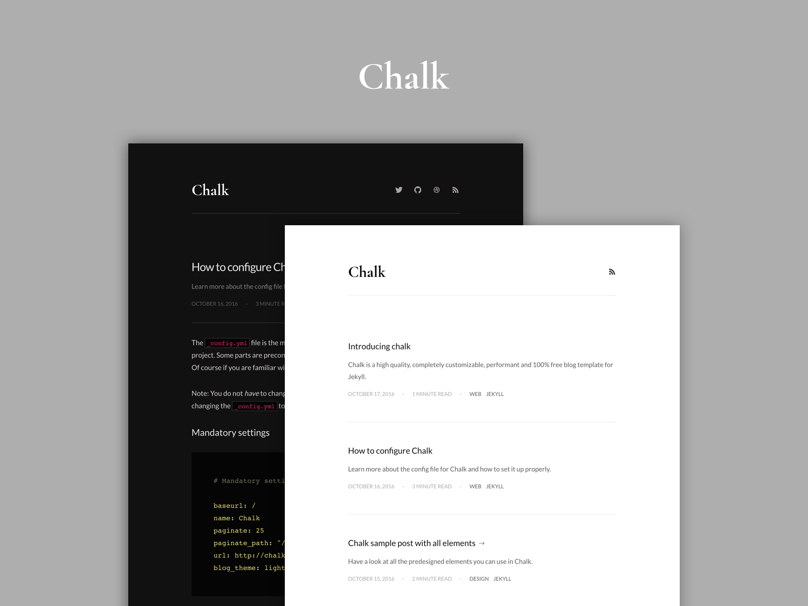

Chalk is a high quality, completely customizable, performant and 100% free blog template for Jekyll.

## Overview

Features:
  - About page.
  - Automatic RSS feed.
  - Automatic sitemap.
  - Automatic time to read post indicator.
  - Cross browser support (supports all modern browsers).
  - Custom 404 page.
  - Custom code highlighting.
  - Customizable pagination.
  - Dark and Light theme.
  - Easy setup and deploying.
  - Enlarge images on click.
  - Filter on tags.
  - Frequently updated with new versions.
  - Many social media links supported.
  - Media embed for videos.
  - PageSpeed optimized.
  - Proper sharing links for posts on Facebook, Twitter and Google Plus.
  - SEO optimized.
  - Support for local fonts.
  - Support for emoji's.

Integrations
  - [Disqus](https://disqus.com/)
  - [Google Analytics](https://analytics.google.com/analytics/web/)
  - [Google Fonts](https://fonts.google.com/)
  - [SVG Icons](https://icomoon.io/)

Used tools
  - [Autoprefixer](https://github.com/postcss/autoprefixer)
  - [Circle CI](https://circleci.com/)
  - [Html-proofer](https://github.com/gjtorikian/html-proofer)
  - [Jekyll](https://jekyllrb.com/)
  - [Jekyll Assets](https://github.com/jekyll/jekyll-assets)
  - [Jekyll Sitemap](https://github.com/jekyll/jekyll-sitemap)
  - [HTML5 Boilerplate](https://html5boilerplate.com/) (Influenced by)
  - [Kickster](https://kickster.nielsenramon.com/)
  - [Retina.js](https://imulus.github.io/retinajs/)
  - [STACSS](https://stacss.nielsenramon.com/)
  - [Travis](https://travis-ci.org/)
  - [Yarn](https://yarnpkg.com)
  - [Zooming](https://github.com/kingdido999/zooming/)

## Usage

### Installation

If you haven't installed the following tools then go ahead and do so (make sure you have [Homebrew](https://brew.sh/) installed):

    brew install ruby
    brew install npm

On windows, install Ruby and Node with the installers found here:

  - [Ruby](https://rubyinstaller.org/)
  - [Node.js](https://nodejs.org/en/download/)

Next setup your environment:

    npm run setup

### Development

Run Jekyll:

    npm run local

## Deploy to GitHub Pages

Before you deploy, commit your changes to any working branch except the `gh-pages` one and run the following command:

    npm run publish

**Important note**: Chalk does not support the standard way of Jekyll hosting on GitHub Pages. You need to deploy your working branch (can be any branch, for xxx.github.io users: use another branch than `master`) with the `npm run publish` command. Reason for this is because Chalk uses Jekyll plugins that aren't supported by GitHub pages. The `npm run publish` command will automatically build the entire project, then push it to the `gh-pages` branch of your repo. The script creates that branch for you so no need to create it yourself. Also, if you are developing a **project site**, you must set the `baseurl` in `_config.yml` to the name of your repository.

You can find more info on how to use the `gh-pages` branch and a custom domain [here](https://help.github.com/articles/quick-start-setting-up-a-custom-domain/).

[View this](https://github.com/nielsenramon/kickster#automated-deployment-with-circle-ci) for more info about automated deployment with Circle CI.

## License

MIT License

## Contributing

1. Fork it (https://github.com/[my-github-username]/chalk/fork)
2. Create your feature branch (`git checkout -b my-new-feature`)
3. Commit your changes (`git commit -am 'Add some feature'`)
4. Push to the branch (`git push origin my-new-feature`)
5. Create a new Pull Request
